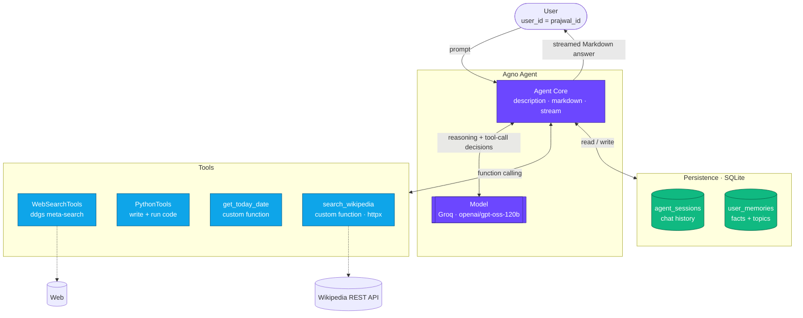
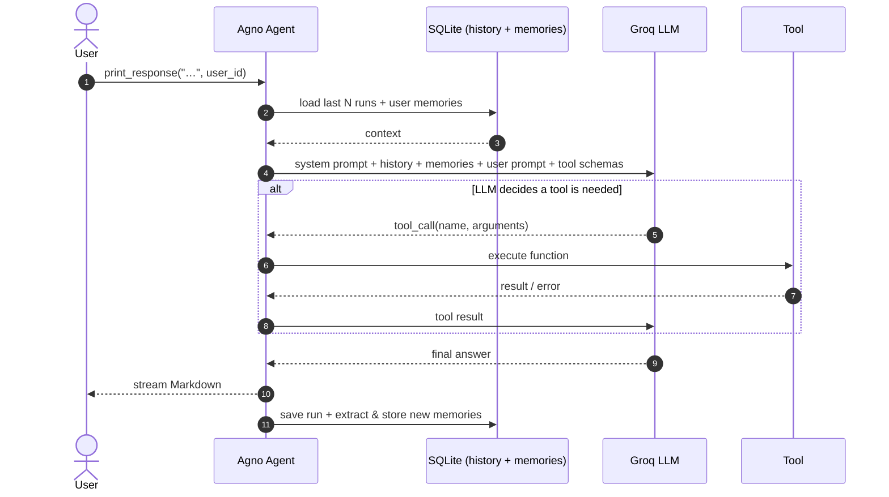
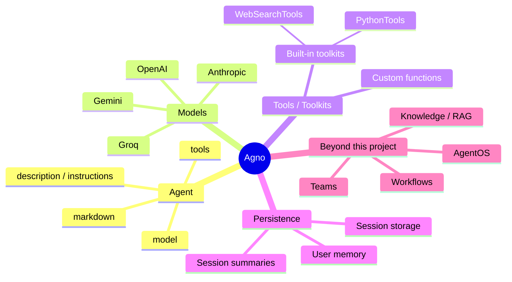
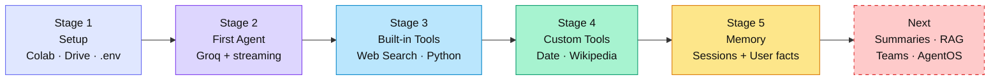
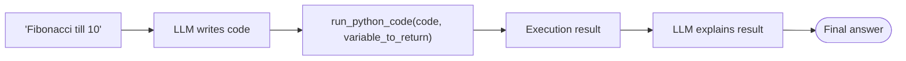
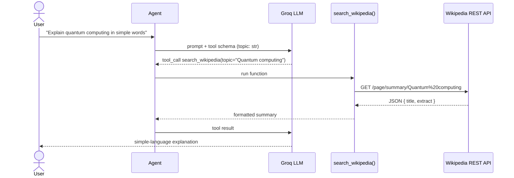
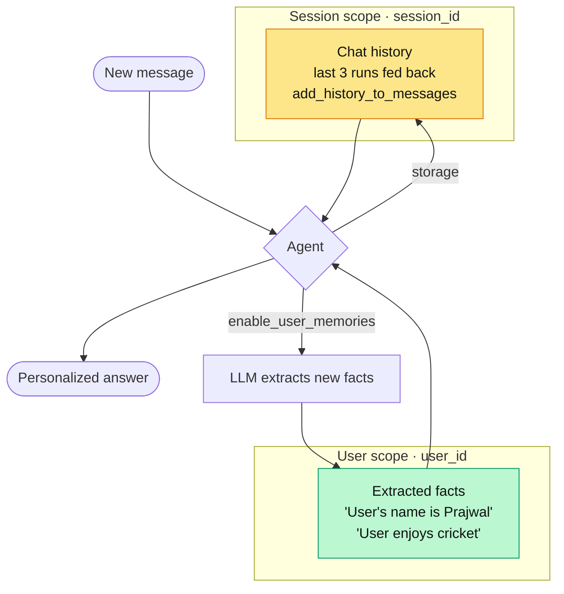

# Build Agentic AI with Agno
### Tools · Agents · Memory — powered by Groq (`gpt-oss-120b`)

*A hands-on, notebook-driven journey from a single LLM call to a tool-using agent with persistent memory.*


</div>

---

## Table of Contents

1. [Overview](#overview)
2. [What This Project Demonstrates](#what-this-project-demonstrates)
3. [Architecture at a Glance](#architecture-at-a-glance)
4. [Tech Stack](#tech-stack)
5. [Agno Framework Primer](#agno-framework-primer)
6. [Notebook Roadmap](#notebook-roadmap)
7. [Stage-by-Stage Deep Dive](#stage-by-stage-deep-dive)
8. [Memory System Deep Dive](#memory-system-deep-dive)
9. [Real Results From the Notebook](#real-results-from-the-notebook)
10. [Known Issues & Fixes](#known-issues--fixes)
11. [Modern Agno API (Upgrade Guide)](#modern-agno-api-upgrade-guide)
12. [Getting Started](#getting-started)
13. [Project Structure](#project-structure)
14. [Best Practices & Security](#best-practices--security)
15. [Roadmap](#roadmap)
16. [Resources](#resources)

---

## Overview

This repository contains a single, progressive Jupyter notebook — **`Build_Agentic_AI_with_Agno_using_Tools_Agents_and_Memory.ipynb`** — that teaches the three pillars of an *agentic AI system* using the **[Agno](https://docs.agno.com)** framework:

| Pillar | Question it answers | Where in the notebook |
|---|---|---|
| **Agent** | *Who is thinking and deciding?* | Stage 2 |
| **Tools** | *What can the agent actually **do**?* | Stages 3 & 4 |
| **Memory** | *What does the agent **remember** about me?* | Stage 5 |

A plain chatbot only *talks*. An **agent** can **decide** to call tools (search the web, run Python, hit an API), observe the result, and then answer — and with memory, it can do this **across conversations**.

>  **LLM provider:** the notebook uses **Groq** (free tier, very fast inference) with the open-weight model **`openai/gpt-oss-120b`** instead of a paid OpenAI key.

---

## What This Project Demonstrates

-  Creating a first **Agno Agent** with a personality (`description`) and Markdown output
-  **Streaming** responses token-by-token (`stream=True`)
-  Using **built-in toolkits**: `WebSearchTools` (live web) and `PythonTools` (code generation + execution)
-  Building **custom tools** from plain Python functions (`get_today_date`, `search_wikipedia`)
-  **Session storage** — conversation history persisted in SQLite
-  **User memory** — facts about the user (name, interests) auto-extracted and stored across chats
-  Secure secret handling with **`python-dotenv`** and Google Drive–hosted `.env`
-  Inspecting stored memories programmatically with `memory.get_user_memories()`

---

## Architecture at a Glance



### The Agent Loop (what happens on every `print_response`)



---

## Tech Stack

| Layer | Technology | Purpose |
|---|---|---|
| Agent framework | **Agno 3.1.1** | Agents, tools, memory, storage |
| LLM provider | **Groq** | Fast, free-tier inference |
| Model | **`openai/gpt-oss-120b`** | The agent's "brain" (tool-calling capable) |
| Web search | **`ddgs`** (via `WebSearchTools`) | Multi-engine meta-search |
| Code execution | **`PythonTools`** | Agent writes & runs Python |
| HTTP client | **`httpx`** | Wikipedia REST API custom tool |
| Database | **SQLite** (+ `sqlalchemy`) | Sessions & user memories |
| Config | **`python-dotenv`** | Loads `GROQ_API_KEY` from `.env` |
| Pretty output | **`rich`** | `pprint` of memories, live streaming |
| Runtime | **Google Colab + Google Drive** | Notebook execution & file persistence |

---

## Agno Framework Primer

[**Agno**](https://docs.agno.com) is a Python framework for building agentic systems — agents that combine a model, tools, memory and knowledge. Everything in this project maps onto a handful of Agno building blocks:



### Core concepts used in this notebook

| Concept | Import | What it does |
|---|---|---|
| **Agent** | `from agno.agent import Agent` | The orchestrator: owns the model, tools, memory, and run loop |
| **Model (Groq)** | `from agno.models.groq import Groq` | Adapter that connects the agent to Groq's API |
| **Toolkit** | `from agno.tools.websearch import WebSearchTools` | A bundle of related functions the LLM can call |
| **Python tool** | `from agno.tools.python import PythonTools` | Lets the LLM generate and execute Python code |
| **Custom tool** | any typed Python function | Agno inspects the **signature + docstring** to build a tool schema |
| **Memory** | `from agno.memory.v2.memory import Memory` | Extracts and recalls user-level facts |
| **Memory DB** | `from agno.memory.v2.db.sqlite import SqliteMemoryDb` | SQLite table backing user memories |
| **Storage** | `from agno.storage.sqlite import SqliteStorage` | SQLite table backing session history |

### Key `Agent(...)` parameters used

| Parameter | Value in notebook | Meaning |
|---|---|---|
| `model` | `Groq(id="openai/gpt-oss-120b")` | LLM that powers the agent |
| `description` | *"You're Prajwal's personal AI assistant…"* | Persona / behavior injected into the system prompt |
| `tools` | `[WebSearchTools(...)]`, `[PythonTools()]`, `[get_today_date]` | Capabilities the agent may invoke |
| `markdown` | `True` | Format answers as Markdown |
| `memory` | `Memory(db=SqliteMemoryDb(...))` | User-memory manager |
| `storage` | `SqliteStorage(...)` | Persists sessions to SQLite |
| `enable_user_memories` | `True` | Auto-extract facts about the user after each run |
| `add_history_to_messages` | `True` | Feed previous turns back to the model |
| `num_history_runs` | `3` | How many past runs to include |
| `session_id` | `"prajwal_chat_session"` | Identifies a conversation thread |
| `print_response(..., stream=True, user_id=...)` | — | Stream tokens; scope memories to a user |

---

## Notebook Roadmap



---

## Stage-by-Stage Deep Dive

### Stage 1 — Environment Setup

```python
!pip install -U -q agno
!pip install python-dotenv groq

from google.colab import drive
drive.mount('/content/drive')
%cd /content/drive/My Drive/
```

```python
from dotenv import load_dotenv
import os

load_dotenv(dotenv_path="/content/drive/My Drive/Agentic_AI_With_Agno_Framework/.env")
api_key = os.getenv("GROQ_API_KEY")
os.environ["GROQ_API_KEY"] = api_key
```

**Why it matters**

- The API key lives in a **`.env` file on Google Drive**, never inside the notebook → safe to share/commit.
- `%cd` into Drive means any relative path (like `temp/…db`) is created **inside Google Drive**, so the SQLite database **survives Colab runtime resets**.

---

### Stage 2 — Your First Agent

```python
from agno.agent import Agent
from agno.models.groq import Groq

agent = Agent(
    model=Groq(id="openai/gpt-oss-120b"),
    description="You're Prajwal's personal AI assistant, friendly, curious, "
                "and always ready to help him learn, build, and explore Agentic AI.",
    markdown=True,
)

agent.print_response("Summarize the story of 'The Lion King'.", stream=True)
```

An agent with **no tools and no memory** is just an LLM with a persona. This is the baseline everything else builds on.

---

### Stage 3 — Built-in Tools

#### 3.1 Web Search → real-time knowledge

```python
from agno.tools.websearch import WebSearchTools

agent = Agent(
    model=Groq(id="openai/gpt-oss-120b"),
    tools=[WebSearchTools(backend="google", enable_search=True, enable_news=False)],
    markdown=True,
)
agent.print_response("Who is the current CEO of Google?", stream=True)
```

`WebSearchTools` uses the **DDGS meta-search library**, so the same toolkit can target multiple engines via `backend=` (`auto`, `duckduckgo`, `google`, `bing`, `brave`, `yandex`, `yahoo`, …).

#### 3.2 Python Tools → the agent codes *and* runs

```python
from agno.tools.python import PythonTools

agent = Agent(model=Groq(id="openai/gpt-oss-120b"), tools=[PythonTools()], markdown=True)
agent.print_response("Write a Python script for Fibonacci series till the 10th number.", stream=True)
```

The LLM **writes** the code, Agno **executes** it, and the result flows back into the answer.



---

### Stage 4 — Custom Tools

> If no pre-built tool exists for your task, **write a Python function and hand it to the agent.**

#### 4.1 Date tool

```python
from datetime import datetime

def get_today_date() -> str:
    """
    Returns today's date
    """
    return datetime.now().strftime("Today is %B %d %Y")

agent = Agent(model=Groq(id="openai/gpt-oss-120b"), tools=[get_today_date], markdown=True)
agent.print_response("What is today's date?", stream=True)
```

LLMs don't know the current date — this tiny tool fixes that. Notebook output: `Today is October 04 2026`.

#### 4.2 Wikipedia summarizer tool

```python
import httpx

def search_wikipedia(topic: str = "Machine Learning") -> str:
    url = f"https://en.wikipedia.org/api/rest_v1/page/summary/{topic.replace(' ', '%20')}"
    response = httpx.get(url, headers={"User-Agent": "Mozilla/5.0"}, timeout=5.0)
    data = response.json()
    if "extract"in data:
        return f"**{data.get('title', topic)}**:\n{data['extract']}"
    return "Sorry, I couldn't find anything on that topic."
```



**How Agno turns a function into a tool:** it reads the **function name, type hints, default values and docstring** and builds a JSON schema that the LLM sees. Good names + docstrings = better tool selection.

---

### Stage 5 — Memory *(the star of the project)*

```python
from agno.agent import Agent
from agno.memory.v2.memory import Memory
from agno.memory.v2.db.sqlite import SqliteMemoryDb
from agno.storage.sqlite import SqliteStorage
from agno.models.groq import Groq

db_file = "temp/prajwal_agent_storage.db"
user_id = "prajwal_id"

memory = Memory(
    db=SqliteMemoryDb(table_name="user_memories", db_file=db_file),
)

agent = Agent(
    model=Groq(id="openai/gpt-oss-120b"),
    description="You're an AI with a memory!",
    memory=memory,
    storage=SqliteStorage(table_name="agent_sessions", db_file=db_file),
    enable_user_memories=True,
    add_history_to_messages=True,
    num_history_runs=3,
    session_id="prajwal_chat_session",
    markdown=True,
)

agent.print_response(
    "I really enjoy playing cricket and watching cricket matches. What sport do you like the most?",
    user_id=user_id,
)

user_memories = memory.get_user_memories(user_id=user_id)
pprint([{"memory": m.memory, "topics": m.topics} for m in user_memories])
```

---

## Memory System Deep Dive

The notebook explains three memory layers in Agno:

| # | Memory type | Scope | Stores | Status in this notebook |
|---|---|---|---|---|
| 1 | **Session Storage** | one conversation (`session_id`) | message history, run data | Implemented (`SqliteStorage` → `agent_sessions`) |
| 2 | **User Memory** | one person, **all** conversations (`user_id`) | name, interests, preferences | Implemented (`Memory` → `user_memories`) |
| 3 | **Session Summaries** | one conversation, condensed | short recap of long chats | Explained, not yet implemented → see [Roadmap](#roadmap) |



### Two databases tables, one SQLite file

```text
temp/prajwal_agent_storage.db
 ├── agent_sessions   ← SqliteStorage     (conversation history per session_id)
 └── user_memories    ← SqliteMemoryDb    (facts + topics per user_id)
```

### Session vs. User memory — the key difference

| | Session history | User memory |
|---|---|---|
| Question it answers | "What did we just say?" | "Who are you and what do you like?" |
| Keyed by | `session_id` | `user_id` |
| Survives a **new** session? | No | Yes |
| Size | Grows with chat | Compact facts |

### Memory object structure

Each stored memory exposes at minimum:

```python
m.memory   # "User enjoys playing and watching cricket."
m.topics   # ["sports", "cricket", "interests"]
```

---

## Real Results From the Notebook

These are the actual outputs captured when the notebook ran on Agno **3.1.1**:

**After the cricket message:**

```python
[{'memory': 'User enjoys playing and watching cricket.',
  'topics': ['sports', 'cricket', 'interests']}]
```

**After "My name is Prajwal, and I am passionate about AI and Data Analytics…":**

```python
[
  {'memory': 'User is passionate about Artificial Intelligence and Data Analytics.',
   'topics': ['interests', 'AI', 'Data Analytics']},
  {'memory': "User's name is Prajwal.", 'topics': ['name']},
  {'memory': 'User enjoys playing and watching cricket.',
   'topics': ['sports', 'cricket', 'interests']}
]
```

| Memory | Topics |
|---|---|
| User is passionate about Artificial Intelligence and Data Analytics. | `interests`, `AI`, `Data Analytics` |
| User's name is Prajwal. | `name` |
| User enjoys playing and watching cricket. | `sports`, `cricket`, `interests` |

 The agent **automatically** turned free-form chat into structured, topic-tagged memories — no manual saving code.

---

## Known Issues & Fixes

Real problems seen in the notebook run — documented so you (and others) can avoid them.

| # | Symptom | Cause | Fix |
|---|---|---|---|
| 1 | `WARNING Could not run function web_search(...): No results found.` for every query | `WebSearchTools(backend="google")` returned nothing from the Colab environment (Google commonly blocks automated scraping) | Use `backend="auto"` or `backend="duckduckgo"`; make sure `ddgs` is installed and up to date |
| 2 | `Tool call validation failed … run_python_code … /variable_to_return: expected string, but got null` | Groq validates tool arguments strictly; the model sent `null` for an optional field | Re-run (non-deterministic), tell the agent in `instructions` to always pass a string, or try another tool-calling model such as `llama-3.3-70b-versatile` |
| 3 | `TypeError` if `.env` is missing | `os.environ["GROQ_API_KEY"] = api_key` fails when `api_key` is `None` | Check first: `assert api_key, "GROQ_API_KEY not found in .env"` |
| 4 | Wikipedia tool says "couldn't find anything"for odd titles | No URL-encoding, no HTTP status check | Use `urllib.parse.quote(topic)` and `response.raise_for_status()` |
| 5 | Import path `agno.memory.v2` looks outdated | Agno's docs now centre on `agno.db.sqlite.SqliteDb` + `MemoryManager` | See [Upgrade Guide](#modern-agno-api-upgrade-guide) |

**Fix for #1:**

```python
WebSearchTools(backend="duckduckgo")   # or backend="auto"
```

**Hardened Wikipedia tool:**

```python
from urllib.parse import quote
import httpx

def search_wikipedia(topic: str = "Machine Learning") -> str:
    """Fetch a short Wikipedia summary for a topic."""
    try:
        r = httpx.get(
            f"https://en.wikipedia.org/api/rest_v1/page/summary/{quote(topic)}",
            headers={"User-Agent": "agno-learning-project/1.0"},
            timeout=5.0,
        )
        r.raise_for_status()
        data = r.json()
        return f"**{data.get('title', topic)}**:\n{data['extract']}"
    except (httpx.HTTPError, KeyError):
        return "Sorry, I couldn't find anything on that topic."
```

---

## Modern Agno API (Upgrade Guide)

The notebook uses the `Memory` / `SqliteMemoryDb` / `SqliteStorage` classes, which worked in the recorded run. The current Agno documentation, however, describes a **unified database object** and two memory modes:

| Mode | Flag | Behavior |
|---|---|---|
| **Automatic memory** | `update_memory_on_run=True` | Memory manager runs after every response (guaranteed capture) |
| **Agentic memory** | `enable_agentic_memory=True` | Agent decides when to store/recall via tool calls (more efficient) |

```python
from agno.agent import Agent
from agno.db.sqlite import SqliteDb
from agno.models.groq import Groq

db = SqliteDb(db_file="tmp/prajwal_agent.db")   # one DB for sessions + memories

agent = Agent(
    model=Groq(id="openai/gpt-oss-120b"),
    db=db,
    update_memory_on_run=True,        # or: enable_agentic_memory=True
    add_history_to_context=True,      # verify exact flag name in your installed version
    num_history_runs=3,
    markdown=True,
)

agent.print_response("My name is Prajwal and I love cricket.", user_id="prajwal_id")
memories = agent.get_user_memories(user_id="prajwal_id")
```

>  Parameter names evolve between Agno releases. Always confirm against [docs.agno.com](https://docs.agno.com) for the version printed by `agno.__version__`.

---

## Getting Started

### Option A — Google Colab (as built)

1. Upload the notebook to Colab.
2. Create this folder in Google Drive: `My Drive/Agentic_AI_With_Agno_Framework/`
3. Inside it, create a `.env` file:
   ```env
   GROQ_API_KEY=gsk_your_key_here
   ```
4. Get a free key at **[console.groq.com](https://console.groq.com)**.
5. Run cells top-to-bottom and approve the Drive-mount prompt.

### Option B — Local machine

```bash
git clone https://github.com/<your-username>/<your-repo>.git
cd <your-repo>

python -m venv venv
source venv/bin/activate          # Windows: venv\Scripts\activate

pip install -U agno groq python-dotenv ddgs httpx sqlalchemy rich googlesearch-python pycountry jupyter

echo "GROQ_API_KEY=gsk_your_key_here" > .env
jupyter notebook
```

Then replace the Colab-only cells (`google.colab`, `%cd /content/drive/...`) with:

```python
from dotenv import load_dotenv
load_dotenv()   # reads .env from the current folder
```

### `requirements.txt`

```text
agno>=3.1.1
groq
python-dotenv
ddgs
httpx
sqlalchemy
rich
googlesearch-python
pycountry
```

---

## Project Structure

```text
Agentic_AI_With_Agno_Framework/
├── Build_Agentic_AI_with_Agno_using_Tools_Agents_and_Memory.ipynb   # main notebook
├── .env                      #  GROQ_API_KEY (never commit)
├── .gitignore
├── requirements.txt
├── README.md
└── temp/
    └── prajwal_agent_storage.db     # auto-created SQLite (sessions + memories)
```

Recommended `.gitignore`:

```gitignore
.env
temp/
*.db
__pycache__/
.ipynb_checkpoints/
```

---

## Best Practices & Security

-  **Never hard-code API keys.** Keep them in `.env` and add `.env` to `.gitignore`.
-  **Clear notebook outputs before committing** — outputs can leak data (this notebook is ~550 KB mostly because of rendered outputs).
-  **`PythonTools` executes model-written code** on your machine/runtime. Use Colab or a sandbox, and never run it with sensitive files or credentials available.
-  **Always give custom tools a docstring and type hints** — they become the tool description the LLM reads.
-  **Handle errors inside tools** and return readable messages so the agent can recover instead of crashing.
-  **Use a unique `user_id` per real person** — memories are scoped by it.
-  **Free-tier limits:** Groq enforces rate limits; add retries/back-off for heavy loops.

---

## Roadmap

- [ ] **Session Summaries** — enable summarization so long chats stay compact (the 3rd memory type introduced in the notebook)
- [ ] Migrate to `SqliteDb` + `update_memory_on_run` / `enable_agentic_memory`
- [ ] Fix web search with `backend="auto"` / `"duckduckgo"` and add a fallback chain
- [ ] **Knowledge / RAG** — let the agent answer from your own PDFs & docs
- [ ] **Multi-agent Team** — e.g. Researcher + Coder + Writer agents
- [ ] **Workflows** — deterministic multi-step pipelines
- [ ] **AgentOS / UI** — serve the agent through an API & chat front-end (Streamlit / Agno UI)
- [ ] Swap SQLite → **PostgreSQL** for multi-user production use
- [ ] Add tests & structured logging

---

## Resources

| Resource | Link |
|---|---|
| Agno Documentation | https://docs.agno.com |
| Agno GitHub & Cookbook | https://github.com/agno-agi/agno |
| Agno Memory Overview | https://docs.agno.com/memory/overview |
| WebSearchTools Docs | https://docs.agno.com/tools/toolkits/search/websearch |
| Groq Console (free API key) | https://console.groq.com |
| Wikipedia REST API | https://en.wikipedia.org/api/rest_v1/ |

---


### Built by **Prajwal**
*Aspiring AI & Data Professional · Exploring Agentic AI with Agno*

 If this helped you learn agentic AI, consider giving the repo a star!

</div>

---

### License

Released under the **MIT License** — free to use for learning and building. *(Add a `LICENSE` file to your repo.)*
